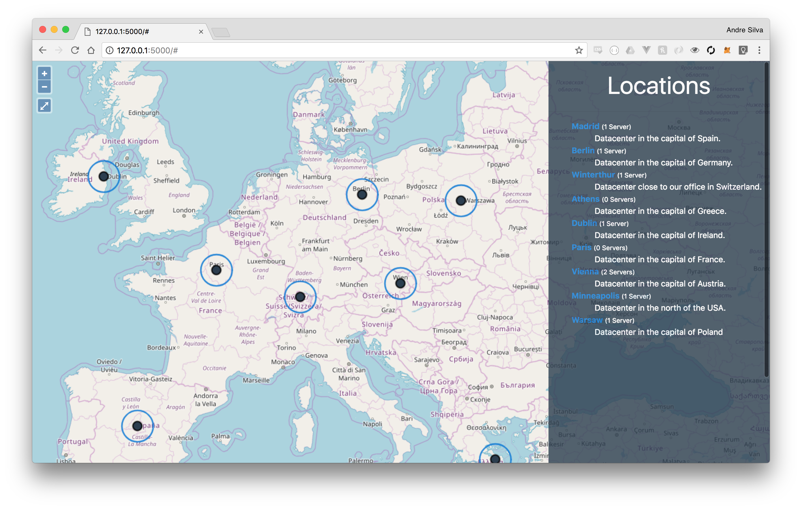

# Complex Challenge

Here you can find all files that were required to complete the second challenge of Boc Group.



## Stack

We used Flask and Python (3.6) to develop this project.


## Usage

To run this, you must install python 3.6 and pipenv using **brew**

> If you don't have brew you can install it by going to their website: https://brew.sh/

```shel
$ brew install python pipenv
```


After installing those two dependencies, run ```$ pipenv install``` to install all necessary requirements.

It's also required to create a **".env"** file containing your developer id:

```text
DEVELOPER_ID=<DEVELOPER IDENTIFIER>
```


Now we just need to run the Flask server like so:
 
```shell
$ pipenv run python manage.py runserver --port=5000
 * Serving Flask app "project" (lazy loading)
 * Environment: production
   WARNING: Do not use the development server in a production environment.
   Use a production WSGI server instead.
 * Debug mode: on
 * Running on http://127.0.0.1:5000/ (Press CTRL+C to quit)
 * Restarting with stat
 * Debugger is active!
```


